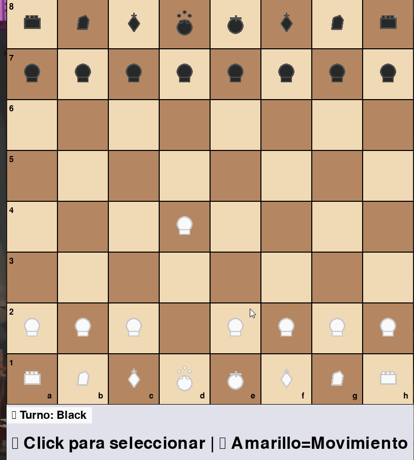

# 🎮 Juego de Ajedrez en Python

Un juego de ajedrez completo y profesional implementado en Python usando Pygame.


## 🚀 Versiones Disponibles

### 1. Versión Básica (`chess_game.py`)

- Funcionalidad básica de ajedrez
- Interfaz simple y clara

### 2. Versión Avanzada (`chess_advanced.py`)

- Detección de jaque y jaque mate
- Validación completa de movimientos
- Mejor interfaz de usuario

### 3. Versión Profesional (`chess_professional.py`)

- **Panel lateral con información completa del juego**
- **Cronómetro para cada jugador**
- **Balance de material en tiempo real**
- **Historial de movimientos con notación**
- **Sistema de guardado de partidas**
- **Coordenadas del tablero**
- **Promoción automática de peones**
- **Detección de empate por ahogado**

## ✨ Características

- ✅ Tablero de ajedrez completo con todas las piezas
- ✅ Movimientos válidos para todas las piezas (peón, torre, caballo, alfil, reina, rey)
- ✅ Interfaz gráfica intuitiva con Pygame
- ✅ Sistema de turnos (blancas y negras)
- ✅ Resaltado de movimientos posibles y capturas
- ✅ Detección de jaque, jaque mate y empate
- ✅ Símbolos Unicode para las piezas
- ✅ Cronómetro de juego
- ✅ Balance de material
- ✅ Guardado de partidas en JSON
- ✅ Promoción de peones
- ✅ Coordenadas del tablero

## Instalación

1. Asegúrate de tener Python 3.7+ instalado
2. Instala las dependencias:
   ```bash
   pip install -r requirements.txt
   ```

## 🎮 Cómo jugar

### Versión Recomendada (Profesional):

```bash
python chess_professional.py
```

### Otras versiones:

```bash
python chess_game.py         # Versión básica
python chess_advanced.py     # Versión avanzada
```

## 🎯 Instrucciones de juego

1. **Seleccionar pieza**: Haz clic en una pieza de tu color
2. **Ver movimientos**: Las casillas destacadas muestran movimientos válidos:
   - 🟡 **Amarillo**: Movimiento normal
   - 🔴 **Rojo**: Captura de pieza enemiga
3. **Mover pieza**: Haz clic en una casilla destacada
4. **Objetivo**: Capturar al rey enemigo (jaque mate)

## ⌨️ Controles

### Versión Profesional:

- **Clic izquierdo**: Seleccionar pieza o mover
- **R**: Reiniciar el juego
- **S**: Guardar partida actual
- **C**: Mostrar/ocultar coordenadas del tablero
- **ESC**: Salir del juego

### Versiones básica y avanzada:

- **Clic izquierdo**: Seleccionar pieza o mover
- **R**: Reiniciar el juego (cuando termine la partida)
- **Cerrar ventana**: Salir del juego

## 🏗️ Estructura del código

### Versión Profesional (`chess_professional.py`):

- `Piece`: Clase que representa cada pieza del ajedrez con valores y funcionalidades avanzadas
- `ChessGame`: Lógica principal del juego, validaciones y estado del juego
- `ChessGUI`: Interfaz gráfica profesional con panel lateral informativo
- `GameState`: Enum para estados del juego (jugando, jaque, jaque mate, empate)

### Funcionalidades por versión:

| Característica      | Básica | Avanzada | Profesional |
| ------------------- | ------ | -------- | ----------- |
| Movimientos válidos | ✅     | ✅       | ✅          |
| Detección de jaque  | ❌     | ✅       | ✅          |
| Jaque mate          | ❌     | ✅       | ✅          |
| Empate (ahogado)    | ❌     | ❌       | ✅          |
| Cronómetro          | ❌     | ❌       | ✅          |
| Balance material    | ❌     | ❌       | ✅          |
| Guardar partidas    | ❌     | ❌       | ✅          |
| Panel informativo   | ❌     | ❌       | ✅          |
| Promoción peones    | ❌     | ✅       | ✅          |
| Coordenadas         | ❌     | ❌       | ✅          |

## ♟️ Reglas implementadas

- **Peón**: Se mueve hacia adelante, puede avanzar 2 casillas en su primer movimiento, captura en diagonal, promoción automática a reina
- **Torre**: Se mueve horizontal y verticalmente
- **Caballo**: Se mueve en forma de L
- **Alfil**: Se mueve diagonalmente
- **Reina**: Combina movimientos de torre y alfil
- **Rey**: Se mueve una casilla en cualquier dirección

## 🚀 Funciones implementadas

- ✅ Todos los movimientos básicos
- ✅ Detección de jaque y jaque mate
- ✅ Detección de empate por ahogado
- ✅ Promoción de peones
- ✅ Cronómetro de juego
- ✅ Balance de material
- ✅ Historial de movimientos
- ✅ Guardado de partidas
- ✅ Validación completa de movimientos

## 🔮 Funciones futuras

- Enroque (castling)
- Captura al paso (en passant)
- Carga de partidas guardadas
- IA para jugar contra la computadora
- Diferentes niveles de dificultad
- Análisis de partidas
- Modo multijugador en red
- Temas visuales personalizables

